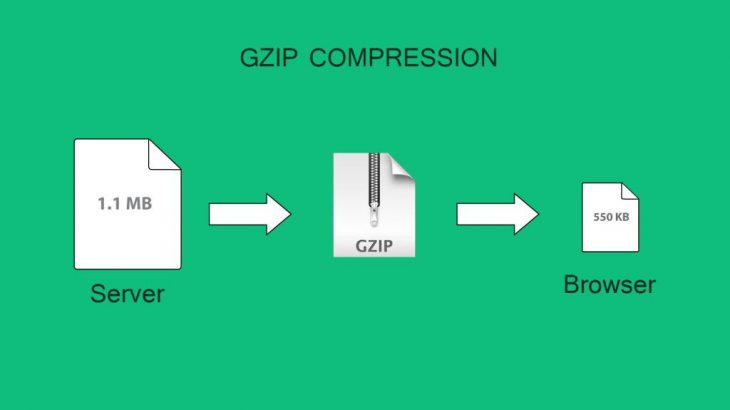
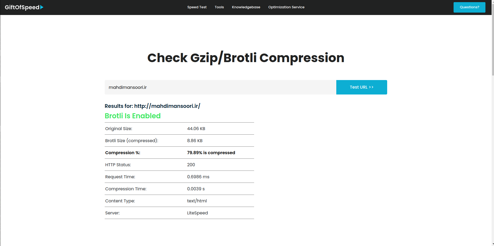

\
**GZIP** compression allows NGINX server to compress data before sending it to client browser. This reduces data bandwidth, improves website speed and saves server costs. Here are the steps to enable NGINX GZip compression.

**How to Enable NGINX Gzip Compression**

**1 Open NGINX Configuration file**
Open terminal and run the following command to open NGINX server configuration file.
```
sudo vi /etc/nginx/nginx.conf
```

> :bulb: **Tip:** If you have configured separate virtual hosts for your website (e.g www.mahdimansoori.ir), such as /etc/nginx/sites-enabled/website.conf then open its configuration with the following command:
> ```
>sudo vi /etc/nginx/sites-enabled/website.conf
>```

**2 Enable GZIP Compression in NGINX**
Add/Uncomment the following lines in your NGINX configuration file.
```
gzip on; 
gzip_vary on; 
gzip_min_length 1024; 
gzip_proxied expired no-cache no-store private auth; 
gzip_types text/plain text/css text/xml text/javascript application/x-javascript application/xml; 
gzip_disable "MSIE [1-6]\.";
```

> :bulb: **Tip:** Let us look at each of the above lines:
> **gzip on** – turns on gzip compression
> **gzip_vary** on – enable gzip for both gzipped and regular versions of a file
> **gzip_min_length** – compress files that are larger than 1024 bytes  (1kb). Small files cannot be compressed much.
> **gzip_proxied** – compress data even for users connected via proxies
> **gzip_types** – specifies the file types to be compressed
> **gzip_disable** – disable gzip for IE browser versions 1-6, since they do not support GZIP compression

**3.Restart NGINX Server**
Run the following command to check syntax of your updated config file.
```
sudo nginx -t
```
If there are no errors, run the following command to restart NGINX server.

```
sudo service nginx reload
```

**4. Verify GZIP Compression**
If you are wondering how to verify GZIP compression in NGINX, then there are many third-party tools like [GZIP compression test](https://www.giftofspeed.com/gzip-test/) where you can enter your website URL and it will tell you if GZIP compression is enabled on your website.

