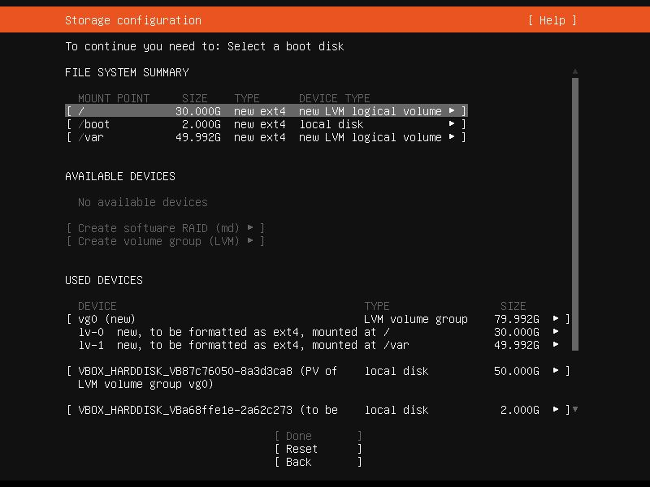
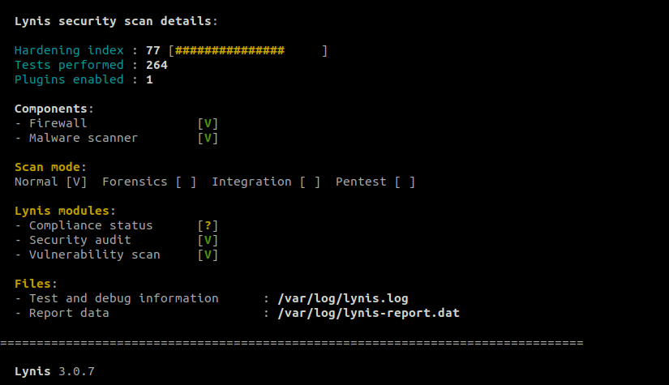
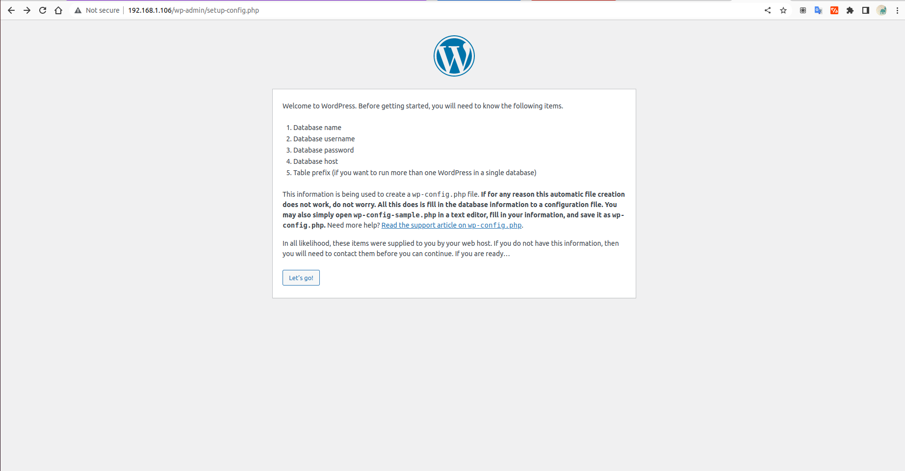

**1.TEST LAB Spec.**\
**HOST OS:** Ubuntu 22.04 Desktop x64\
**HDD:** SSD\
**RAM:** 8GB\
**Virtualization Platform:** VirtualBox 6.1\
\
**2.Linux Server Installation Step**\
**2.1 Allocated Resource:**\
<span style="color:DarkCyan">■</span> **VM Name:** LABNIX\
<span style="color:DarkCyan">■</span> **HDD:** (2GB, 30GB, 50GB)\
<span style="color:DarkCyan">■</span> **RAM:** 2GB\
<span style="color:DarkCyan">■</span> **OS:** Ubuntu Server 22.04.1 x64\
<span style="color:DarkCyan">■</span> **Network:** Bridged\
\
**2.2 Installation Screen shots:**\
 

**2.3 Updating Server**\
64 packaged Installed\
\
**2.4 Hardening**\
**2.4.1 Lynis running...**\
<span style="color:DarkCyan">■</span> 238 Test performed. Hardening index: 60\
<span style="color:DarkCyan">■</span> Applied Control: BANN-7126, BANN-7130, AUTH-9262, PKGS-7370,PKGS-7394, ACCT-9626, FINT-4350, SSH-7408, MAIL-8818, DEB-0880\
<span style="color:DarkCyan">■</span> Installed software in this step: ClamAV, chkrootkit, auditd\
<span style="color:DarkCyan">■</span> Other action: Disabling USB storage on server\
\
**2.4.2 Result**\
\
**<center>Final Score: 77</center>**\
\
**3. Install WordPress**\
**3.1. Install and start nginx**
```
apt-get install nginx 
systemctl enable nginx.service 
systemctl start nginx.service
```
**3.2. Check service status** 
```
systemctl status nginx 
● nginx.service - A high performance web server and a reverse proxy server 
     Loaded: loaded (/lib/systemd/system/nginx.service; enabled; vendor preset: enabled) 
     Active: active (running) since Fri 2023-03-03 13:29:37 UTC; 3min 50s ago 
       Docs: man:nginx(8) 
   Main PID: 2766 (nginx) 
      Tasks: 2 (limit: 2234) 
     Memory: 4.4M 
        CPU: 26ms 
     CGroup: /system.slice/nginx.service 
             ├─2766 "nginx: master process /usr/sbin/nginx -g daemon on; master_process on;" 
             └─2767 "nginx: worker process" "" "" "" "" "" "" "" "" "" "" "" "" "" "" "" "" "" "" ""> 
Mar 03 13:29:37 labnix systemd[1]: Starting A high performance web server and a reverse proxy server> 
Mar 03 13:29:37 labnix systemd[1]: Started A high performance web server and a reverse proxy server. 
```

**3.3 Install MariaDB**
```
apt-get install mariadb-server  
systemctl enable mariadb.service 
systemctl start mariadb.service 
mysql_secure_installation 
```

**3.3.1 Securing MariaDB:**\
<span style="color:DarkCyan">■</span> Change root password\
<span style="color:DarkCyan">■</span> Remove ananymous users\
<span style="color:DarkCyan">■</span> Disallow remotly login\
<span style="color:DarkCyan">■</span> Remove test databases and access to it\

**3.4 Install PHP**
```
apt-get install php php-mysql php-fpm php-curl php-gd php-intl php-mbstring php-soap php-xml php-xmlrpc php-zip mariadb-server mariadb-client 
```

**3.4.1 Start and enable PHP FastCGI process manager**
```
systemctl enable php8.1-fpm 
systemctl start php8.1-fpm 
```

**3.5 Create Database for WordPress**
```
sudo mysql -u root -p 
CREATE DATABASE wpress CHARACTER SET utf8mb4 COLLATE utf8mb4_general_ci; 
CREATE USER 'wpressuser'@'localhost' IDENTIFIED BY 'qwe123!@#'; 
GRANT ALL ON wpress.* TO 'wpressuser'@'localhost'; 
FLUSH PRIVILEGES; 
EXIT; 
```

**3.6 Download and Install WordPress**
```
sudo mkdir -p /var/www/html/wpress 
wget http://wordpress.org/latest.tar.gz 
tar xfvz latest.tar.gz 
sudo cp -r wordpress/* /var/www/html/wpress 
sudo chown -R www-data /var/www/html/wpress 
sudo chmod -R 755 /var/www/html/wpress 
```

**3.7 Create NGINX Virtual Host for WordPress**
```
sudo nano /etc/nginx/conf.d/wpress.conf 
```
Adding below configuration: 
```
server { 
    listen 80; 
    listen [::]:80; 
    root /var/www/html/wpress; index index.php index.html index.htm; 
    server_name wpress.conf www.wpress.conf; 
    error_log /var/log/nginx/wpress.conf_error.log; 
    access_log /var/log/nginx/wpress.conf_access.log; 
    client_max_body_size 100M; 
    location / { 
       try_files $uri $uri/ /index.php?$args; 
    } 
    location ~ \.php$ { 
       include snippets/fastcgi-php.conf; 
       fastcgi_pass unix:/run/php/php8.1-fpm.sock; 
    } 
} 
```
**3.7.1 Remove the default Nginx server site**
```
sudo rm /etc/nginx/sites-enabled/default
```

**3.7.2 Restart Nginx**
```
systemctl restart nginx.service
```
